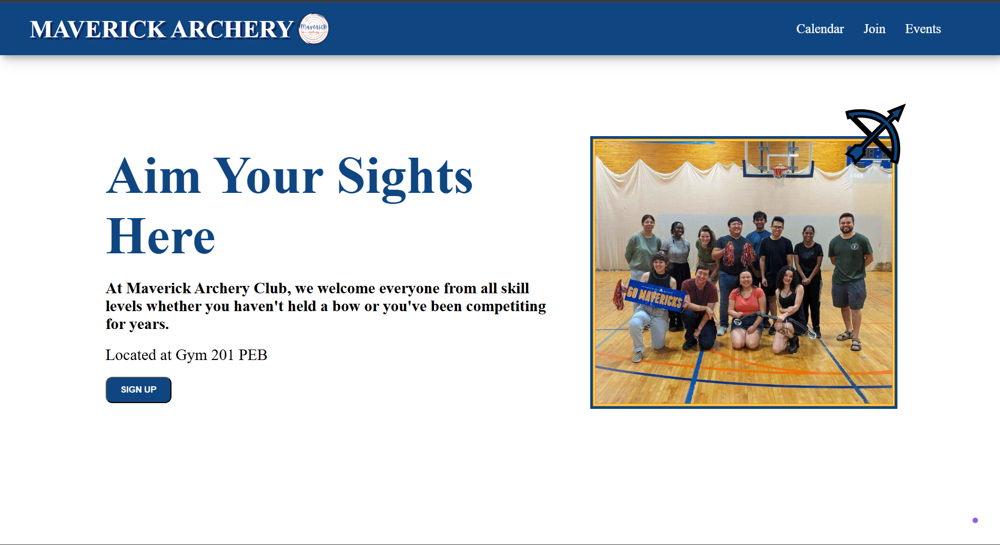
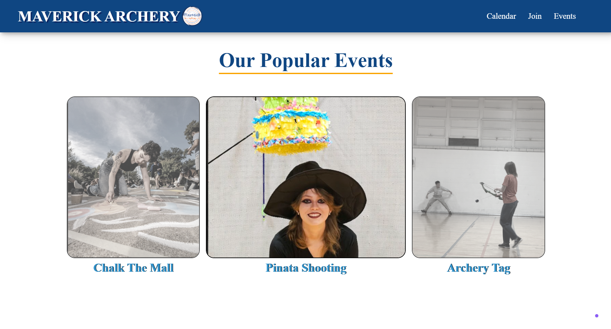
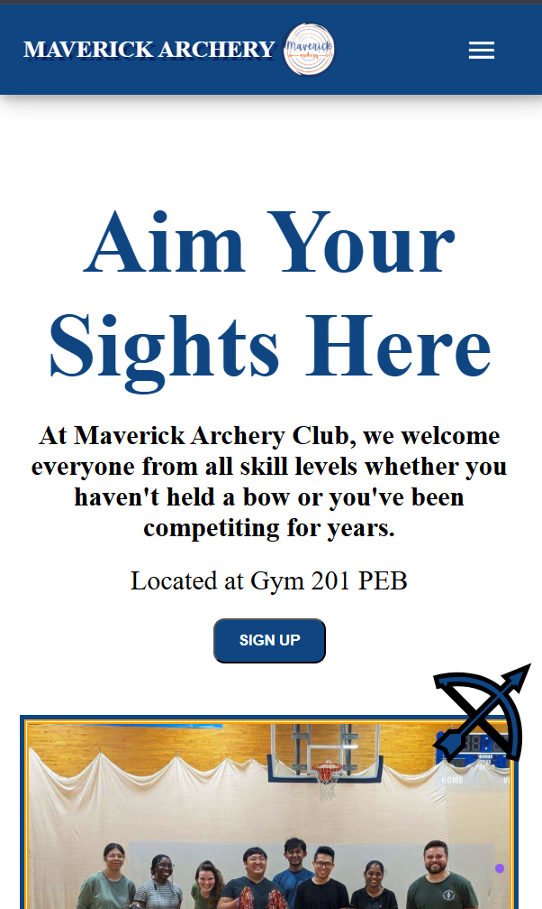

# Maverick Archery Home Dashboard

## Project Overview
A responsive design web interface made during Spring Break, initially as UI design practice for an ACM Create project at UTA, for the Maverick Archery club at UTA with minimal library and framework usage compared to other projects.

## Sections
* **Hero page** to introduce the club
* Calendar linked with Google Calendar with **Future events**
* **Join-section** on the steps needed to become a member
* **Popular events** that includes pictures of events the Maverick Archery club is known for

### Desktop View

### Events Section

### Mobile View

## Future Ideas to Implement
* Ability to press side buttons on smaller screens to scroll through popular events
* Implementation of React library and newsletter opportunity
* Utilize different fonts that matches with the theme
